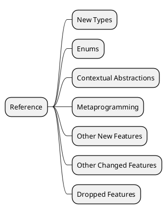
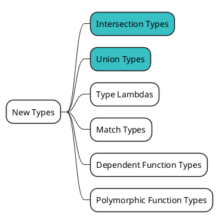
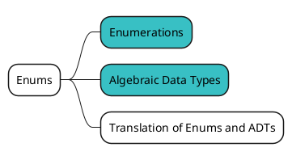
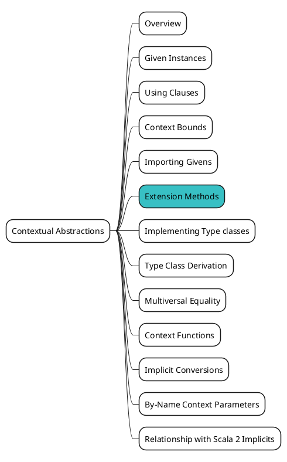
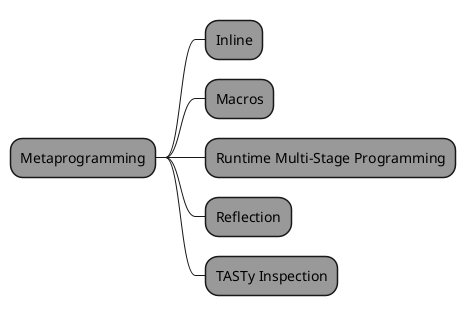
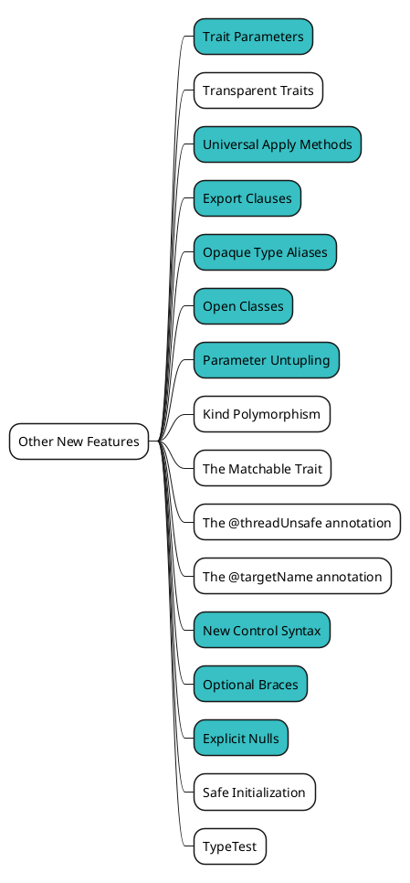
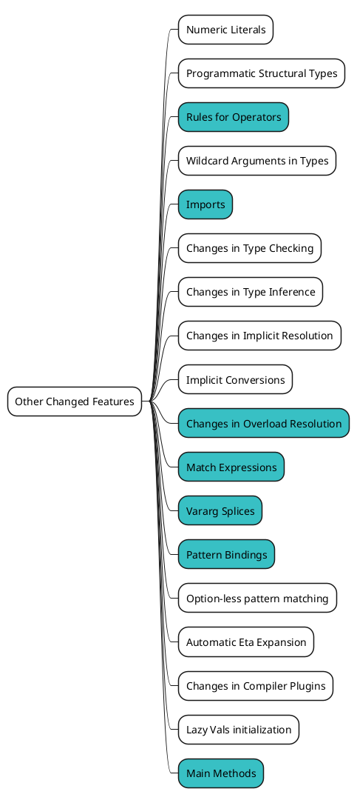
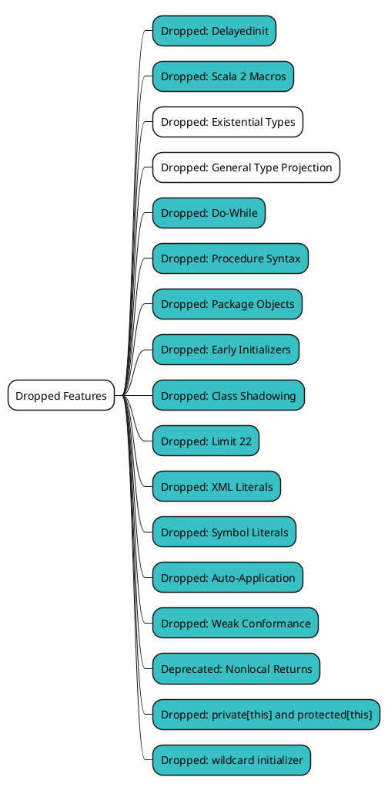

# Referenceを俯瞰してみる {ignore=true}

<!-- @import "[TOC]" {cmd="toc" depthFrom=1 depthTo=6 orderedList=false} -->

<!-- code_chunk_output -->

- [概要](#概要)
- [New Types](#new-types)
- [Enums](#enums)
- [Contextual Abstractions](#contextual-abstractions)
- [Metaprogramming](#metaprogramming)
- [Other New Features](#other-new-features)
- [Other Changed Features](#other-changed-features)
- [Dropped Features](#dropped-features)

<!-- /code_chunk_output -->

## 概要

Scala 3 の新しい仕様を確認していくのは、やはり [Reference](https://dotty.epfl.ch/docs/reference/overview.html) が良さそうです。
ただ、結構なページ数があるのと、難易度がバラバラなので、上から順番に見ていくのはしんどいかもしれません。
そこで、まずはこの Part で見ておきたいものを抽出し、それらを順番に見ていきたいと思います。

まず、Reference はこのようなカテゴリに分かれています。

それぞれのカテゴリには、様々な言語仕様についてのページがありますが、
カテゴリごとにこの Part で見ておきたいページに色付けしてみましょう。

## New Types

https://dotty.epfl.ch/docs/New%20Types/

## Enums

https://dotty.epfl.ch/docs/Enums/

## Contextual Abstractions

https://dotty.epfl.ch/docs/Contextual%20Abstractions/

Scala 2 では様々な役割を持っていた `implicit` が、Scala 3 では機能毎に書き方が分かれました。
implicit parameter や型クラスの新しい書き方などは今後見るとして、最初は `Extension Methods` を見ていきましょう。

## Metaprogramming

https://dotty.epfl.ch/docs/Metaprogramming/

Metaprogramming は、必要に応じて見れば良いので、今回は除外します。

## Other New Features

https://dotty.epfl.ch/docs/Other%20New%20Features/

## Other Changed Features

https://dotty.epfl.ch/docs/Other%20Changed%20Features/

## Dropped Features

https://dotty.epfl.ch/docs/Dropped%20Features/

