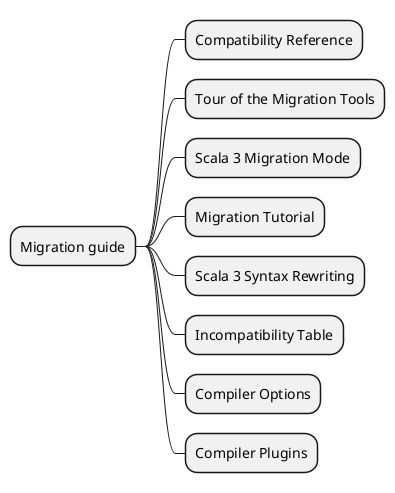
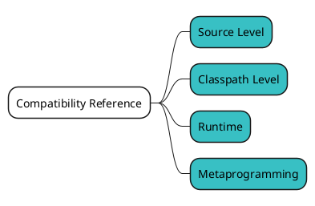
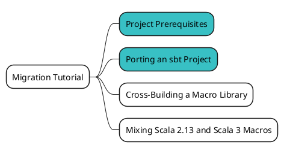
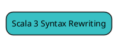
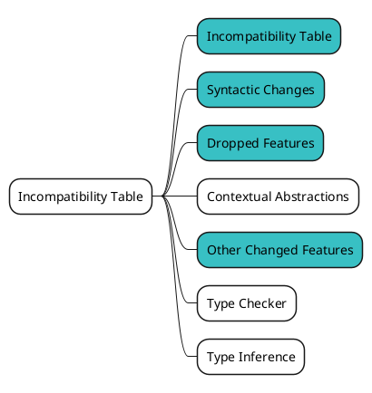
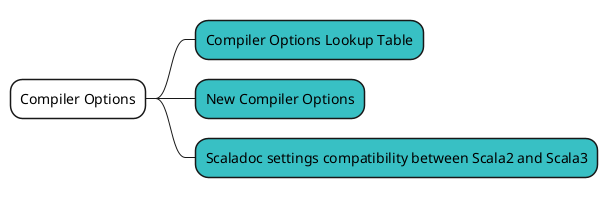
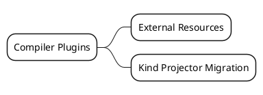
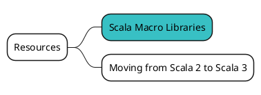

# Migration Guide を俯瞰してみる {ignore=true}

<!-- @import "[TOC]" {cmd="toc" depthFrom=1 depthTo=6 orderedList=false} -->

<!-- code_chunk_output -->

- [概要](#概要)
- [Compatibility Reference](#compatibility-reference)
- [Tour of the Migration Tools](#tour-of-the-migration-tools)
- [Scala 3 Migration Mode](#scala-3-migration-mode)
- [Migration Tutorial](#migration-tutorial)
- [Scala 3 Syntax Rewriting](#scala-3-syntax-rewriting)
- [Incompatibility Table](#incompatibility-table)
- [Compiler Options](#compiler-options)
- [Compiler Plugins](#compiler-plugins)
- [Resources](#resources)

<!-- /code_chunk_output -->

## 概要

Scala 3 へのマイグレーション方法や Scala 2 との互換性・非互換性を確認するために、[Migration Guide](https://docs.scala-lang.org/scala3/guides/migration/compatibility-intro.html) の内容も俯瞰してみましょう。こちらも情報量が多いので、見るものを選別します。

まず、Migration Guide はこのようなカテゴリに分かれています。

この内、カテゴリごとにこの Part で見ておきたいページに色付けしてみましょう。

## Compatibility Reference

https://docs.scala-lang.org/scala3/guides/migration/compatibility-intro.html

## Tour of the Migration Tools

https://docs.scala-lang.org/scala3/guides/migration/tooling-tour.html

## Scala 3 Migration Mode

https://docs.scala-lang.org/scala3/guides/migration/tooling-migration-mode.html

## Migration Tutorial

https://docs.scala-lang.org/scala3/guides/migration/tutorial-intro.html

## Scala 3 Syntax Rewriting

https://docs.scala-lang.org/scala3/guides/migration/tooling-syntax-rewriting.html

## Incompatibility Table

https://docs.scala-lang.org/scala3/guides/migration/incompatibility-table.html

## Compiler Options

https://docs.scala-lang.org/scala3/guides/migration/options-intro.html

## Compiler Plugins

https://docs.scala-lang.org/scala3/guides/migration/plugin-intro.html

## Resources

https://scalacenter.github.io/scala-3-migration-guide/docs/macros/macro-libraries.html

