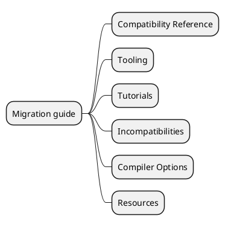
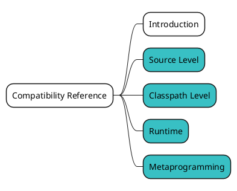
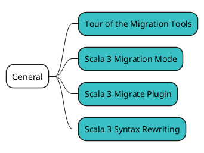
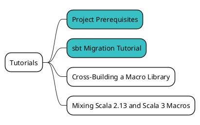
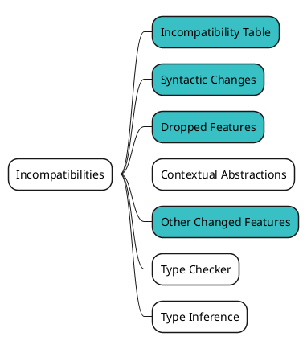
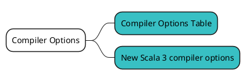
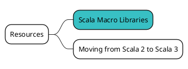

# Scala 3 Migration guide を俯瞰してみる {ignore=true}

<!-- @import "[TOC]" {cmd="toc" depthFrom=1 depthTo=6 orderedList=false} -->

<!-- code_chunk_output -->

- [概要](#概要)
- [Compatibility Reference](#compatibility-reference)
- [Tooling](#tooling)
- [Tutorials](#tutorials)
- [Incompatibilities](#incompatibilities)
- [Compiler Options](#compiler-options)
- [Resources](#resources)

<!-- /code_chunk_output -->

## 概要

Scala 3 のマイグレーションや Scala 2 との互換性、非互換性を確認するために、[Scala 3 Migration guide](https://scalacenter.github.io/scala-3-migration-guide/) の内容も俯瞰してみましょう。こちらも情報量が多いので、見るものを選別します。

まず、Migration guide はこのようなカテゴリに分かれています。

## Compatibility Reference

https://scalacenter.github.io/scala-3-migration-guide/docs/compatibility/introduction.html

## Tooling

https://scalacenter.github.io/scala-3-migration-guide/docs/tooling/migration-tools.html

## Tutorials

https://scalacenter.github.io/scala-3-migration-guide/docs/tutorials/prerequisites.html

## Incompatibilities

https://scalacenter.github.io/scala-3-migration-guide/docs/incompatibilities/incompatibility-table.html

## Compiler Options

https://scalacenter.github.io/scala-3-migration-guide/docs/compiler-options/compiler-options-table.html

## Resources

https://scalacenter.github.io/scala-3-migration-guide/docs/macros/macro-libraries.html

