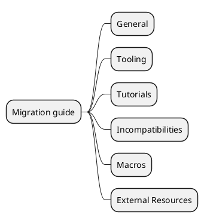
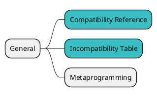
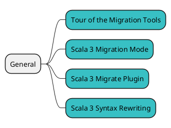
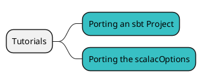
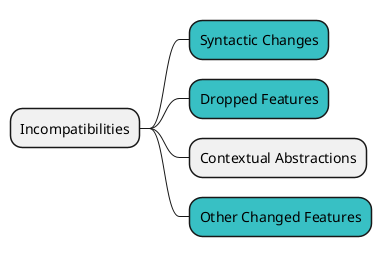
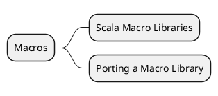
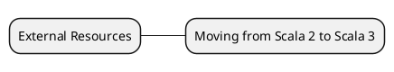

# Scala 3 Migration guide を俯瞰してみる {ignore=true}

<!-- @import "[TOC]" {cmd="toc" depthFrom=1 depthTo=6 orderedList=false} -->

<!-- code_chunk_output -->

- [概要](#概要)
- [General](#general)
- [Tooling](#tooling)
- [Tutorials](#tutorials)
- [Incompatibilities](#incompatibilities)
- [Macros](#macros)
- [External Resources](#external-resources)

<!-- /code_chunk_output -->

## 概要

Scala3 のマイグレーションや Scala2 系との互換性を確認するために、[Scala 3 Migration guide](https://scalacenter.github.io/scala-3-migration-guide/) の内容も俯瞰してみましょう。こちらも情報量が多いので、見るものを選別します。

まず、Migration guide はこのようなカテゴリに分かれています。

## General

https://scalacenter.github.io/scala-3-migration-guide/docs/compatibility.html

## Tooling

## Tutorials

https://scalacenter.github.io/scala-3-migration-guide/docs/tutorials/sbt-migration.html

## Incompatibilities

https://scalacenter.github.io/scala-3-migration-guide/docs/incompatibilities/table.html

## Macros

https://scalacenter.github.io/scala-3-migration-guide/docs/macros/macro-libraries.html

必要に応じて見れば良いので、今回は除外します。

## External Resources

https://scalacenter.github.io/scala-3-migration-guide/docs/external-resources/moving-from-scala-2-to-scala-3.html

リンク先の [Moving Forward from Scala 2 to Scala 3](https://github.com/lunatech-labs/lunatech-scala-2-to-scala3-course) が更新されてないので除外します。

