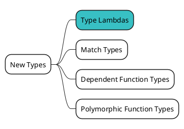
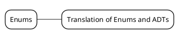
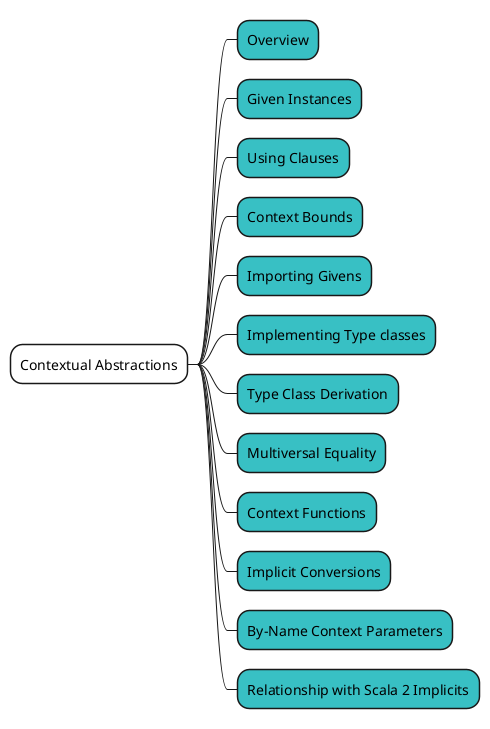
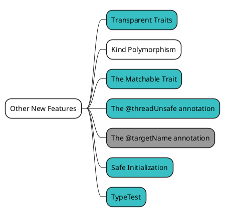
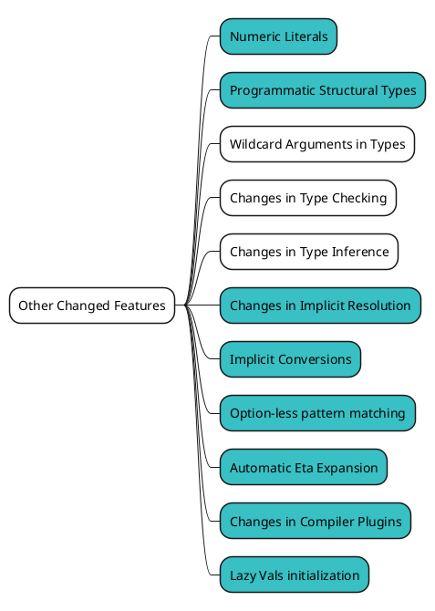
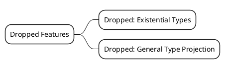

# Referenceを俯瞰してみる {ignore=true}

<!-- @import "[TOC]" {cmd="toc" depthFrom=1 depthTo=6 orderedList=false} -->

<!-- code_chunk_output -->

- [概要](#概要)
- [New Types](#new-types)
- [Enums](#enums)
- [Contextual Abstractions](#contextual-abstractions)
- [Other New Features](#other-new-features)
- [Metaprogramming](#metaprogramming)
- [Other Changed Features](#other-changed-features)
- [Dropped Features](#dropped-features)

<!-- /code_chunk_output -->

## 概要

ここまでで、[Reference](https://dotty.epfl.ch/docs/reference/overview.html) や [Migration guide](https://scalacenter.github.io/scala-3-migration-guide) などから、Part 1 で確認しておきたいものは一通り終えました。ここからは Part 2 ということで、Scala 3 の更に深い部分について触れていきたいと思います。

それでは、改めて [Reference](https://dotty.epfl.ch/docs/reference/overview.html) を俯瞰し、次に見ておきたいページを抽出したいと思います。

なお、ここまでで確認済みのページに関しては除外してあります。

## New Types

https://dotty.epfl.ch/docs/New%20Types/

型クラスの実装で必要となる Type Lambdas を確認します。

## Enums

https://dotty.epfl.ch/docs/Enums/

:construction: ここは敢えて今見なくても良いとも思うので、除外するかも :construction:

## Contextual Abstractions

https://dotty.epfl.ch/docs/Contextual%20Abstractions/

Extension Methods は Part 1 で確認したので、それ以外をやりましょう！

## Other New Features

https://dotty.epfl.ch/docs/Other%20New%20Features/

`The @targetName annotation` は Part 1 で軽く触れたので、今回はこれ以上深堀りしなくても良さそう。

:construction: どこまで中盤でやるか考え中 :construction:

## Metaprogramming

https://dotty.epfl.ch/docs/Metaprogramming/

Metaprogramming は、必要に応じて見れば良いので、今回は除外します。

## Other Changed Features

https://dotty.epfl.ch/docs/Other%20Changed%20Features/

## Dropped Features

https://dotty.epfl.ch/docs/Dropped%20Features/

:construction: ここに触れるか考え中 :construction:

